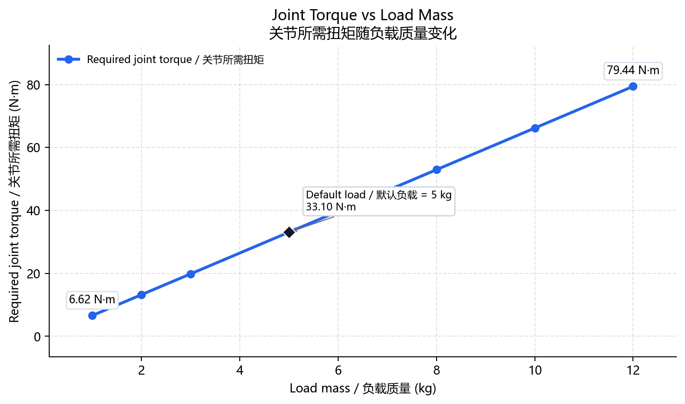
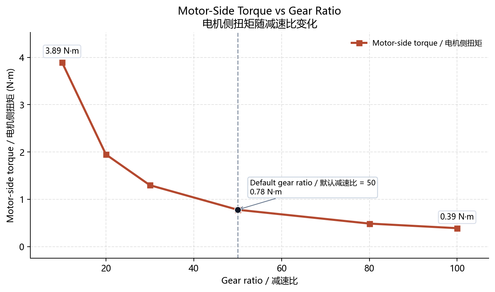
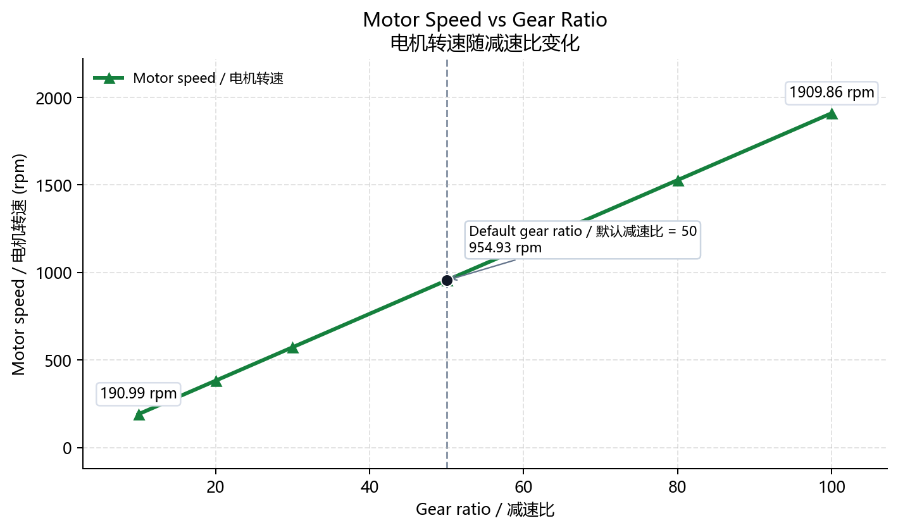

# Robot Joint Actuator Design Tool

面向机器人关节执行器初步设计的 Python 计算工具。项目用于快速估算关节最大扭矩、电机侧扭矩、电机转速、减速器输出参数、功率需求和安全系数，适合作为车辆工程、机械设计、机器人方向本科生的求职作品集项目。

## 项目定位

机器人关节执行器选型时，通常需要先根据负载、连杆长度、目标运动速度和加速度估算关节端需求，再结合减速比和传动效率换算到电机侧。本项目把这些基础计算整理成一个可复用的小工具，并增加参数配置和曲线绘图，方便展示工程建模、Python 编程和设计校核能力。

## 功能

- 输入负载质量、连杆长度、目标角速度、目标角加速度、减速比、传动效率和安全系数。
- 输出关节重力矩、加速力矩、关节需求扭矩、电机侧扭矩、电机转速、减速器输出转速、估算功率和设计校核结果。
- 使用 `config.yaml` 管理默认设计参数、设计限制和绘图参数。
- 使用 `matplotlib` 生成不同负载和不同减速比下的扭矩、转速变化曲线。
- 代码结构简单，便于在简历、面试和课程项目中讲清楚建模假设和计算流程。

## 效果展示



关节所需扭矩随负载质量增加而上升，可用于判断负载变化对关节端扭矩需求的影响。



减速比提高后，电机侧所需扭矩降低，可用于比较不同减速器方案对电机扭矩的影响。



减速比提高会使电机转速按比例上升，因此需要同时校核电机转速上限。

### 核心结论

减速比增大可以降低电机侧扭矩需求，但会提高电机转速，因此执行器选型需要在扭矩、转速、效率和安全系数之间折中。

## 默认设计参数

| 参数 | 默认值 | 单位 |
| --- | ---: | --- |
| 负载质量 | 5.0 | kg |
| 连杆长度 | 0.35 | m |
| 目标角速度 | 2.0 | rad/s |
| 目标角加速度 | 8.0 | rad/s² |
| 减速比 | 50 | - |
| 传动效率 | 0.85 | - |
| 安全系数 | 1.5 | - |

## 计算假设

当前版本采用初步设计阶段常用的保守估算：

- 负载等效为连杆末端集中质量。
- 最大重力矩按连杆水平位置估算：`Tg = m * g * L`。
- 加速力矩按末端集中质量转动惯量估算：`Ta = m * L^2 * alpha`。
- 关节需求扭矩：`T_required = (Tg + Ta) * safety_factor`。
- 电机侧扭矩：`T_motor = T_required / (gear_ratio * efficiency)`。
- 电机转速：`n_motor = omega * gear_ratio * 60 / (2*pi)`。
- 估算功率：`P = T_required * omega / efficiency`。

这些公式适合方案比较和初步选型。详细设计时，还需要进一步考虑连杆自重、摩擦、冲击载荷、热设计和实际电机转矩-转速曲线。

## 适用范围与局限性

本项目适合用于机器人关节执行器的初步选型和参数敏感性分析，可以帮助快速比较负载、减速比和运动指标对扭矩、转速、功率的影响。当前模型不等同于详细结构设计，尚未覆盖连杆分布质量、轴承与齿轮强度、热平衡、疲劳寿命、冲击载荷和控制系统动态响应等因素。

## 项目结构

```text
robot-joint-actuator-design-tool/
├── actuator_design.py        # 核心计算函数
├── main.py                   # 命令行计算入口
├── plot_torque_curves.py     # 曲线绘图脚本
├── config.yaml               # 参数配置文件
├── docs/                     # README 展示图片
├── requirements.txt          # Python 依赖
├── .gitignore
└── README.md
```

## 安装

建议使用 Python 3.10 或更高版本。

```bash
pip install -r requirements.txt
```

## 快速运行

使用默认配置计算：

```bash
python main.py
```

示例输出：

```text
Robot Joint Actuator Design Result
----------------------------------------
Gravity torque:                  17.168 N·m
Acceleration torque:              4.900 N·m
Nominal joint torque:            22.067 N·m
Required joint torque:           33.101 N·m
Motor-side torque:                0.779 N·m
Motor speed:                      954.9 rpm
Reducer output torque:           33.101 N·m
Reducer output speed:             19.1 rpm
Estimated power:                  77.9 W
Actual safety factor:             1.54
Meets design requirement:          YES
Check message:               passed all configured checks
```

也可以在命令行覆盖部分参数：

```bash
python main.py --load-mass-kg 8 --gear-ratio 80 --safety-factor 1.8
```

## 生成曲线

```bash
python plot_torque_curves.py
```

生成图片默认保存在 `docs/`，可直接用于 GitHub README 展示：

- `docs/torque_vs_load.png`：不同负载质量下的关节需求扭矩。
- `docs/motor_torque_vs_gear_ratio.png`：不同减速比下的电机侧扭矩。
- `docs/motor_speed_vs_gear_ratio.png`：不同减速比下的电机转速。

`outputs/` 不作为项目展示文件提交。

## 配置说明

`config.yaml` 中的主要字段：

```yaml
inputs:
  load_mass_kg: 5.0
  link_length_m: 0.35
  target_angular_velocity_rad_s: 2.0
  target_angular_acceleration_rad_s2: 8.0
  gear_ratio: 50
  transmission_efficiency: 0.85
  safety_factor: 1.5

design_limits:
  max_motor_torque_nm: 0.8
  max_motor_speed_rpm: 5000
  max_power_w: 200
```

`design_limits` 用于判断当前方案是否满足设计要求。程序会检查电机侧扭矩、电机转速、估算功率和安全系数是否在配置范围内。

## 可展示的工程能力

这个项目可以在简历或面试中说明以下能力：

- 能把机械系统需求转化为可计算的工程模型。
- 能理解关节端和电机侧之间由减速器连接的参数换算关系。
- 能用 Python 编写清晰、可维护的工程计算脚本。
- 能使用 YAML 管理设计参数，避免把数据硬编码在程序中。
- 能用图表对比不同设计变量对结果的影响。

## 后续可扩展方向

- 增加连杆自重和转动惯量建模。
- 增加电机额定转矩、峰值转矩和转矩-转速曲线校核。
- 增加批量方案对比并导出 CSV。
- 增加简单图形界面或网页界面，便于非编程用户使用。
